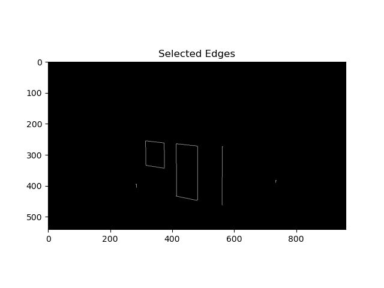
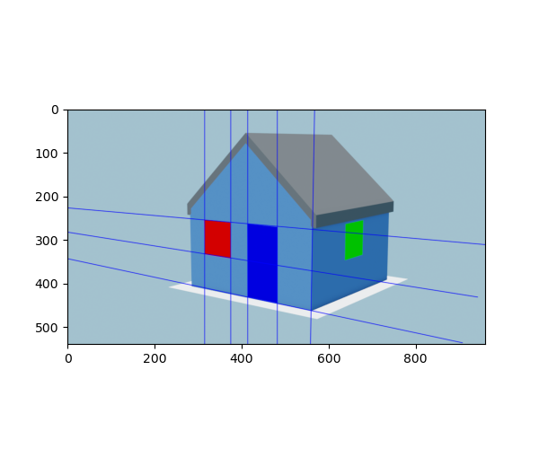
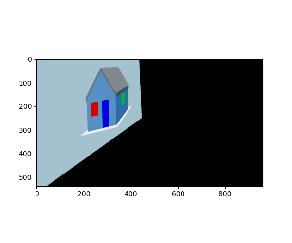

# Project 1
> ### Authors:
> - Michele Cattaneo
> - Nicolai hermann
> - Oliver Tryding

## Preliminaries
### Used Libraries
```shell
pip install -r requirements.txt
```

### How to run the code
`python affine_rectification.py`

## Edge Detection
For the edge detection we reimplemented the canny edge detection.
1. We computed the gradient magnitude on the grayscale image:  
     
2. We applied non maxima suppression with additional constraint that we only consider those neighbours that have a similar gradient. This helps to avoid disconnected edges incase two perpendicular edges intersect. We only want to apply the suppression on those pixels that belong to our edge, not those that belong to a different edge.  
   
3. Double thresholding was applied to differentiate between strong and weak edges with thresholds $t_{low} = 10$ and $t_{high} = 40$. The result is shown below:  
   
4. Our final result is shown on the left and the cv2.Canny as a ground truth on the right. Our implementation with the adapted NMS seems to perform slightly better than the cv2 implementation.  
   <div style="display: flex;">
      
      
   </div>
> When comparing to the cv2.Canny implementation with the same parameters we observe almost no error as the difference plot shows below. Gray pixels indicate no error, white that they are only in the cv2 implementation and black that they were not in the cv2 implementation.  


## Guided Hough Transform
To now extract the lines out of the image we wrote a guided hough transform which prefilters the edges based on neighbouring color values. We leveraged the coloring of the image to select edges based on the colors to their sides. To retain an edge it had to include at least two colors (left and right of the edge) in its neighbourhood.  
  
This helped to reduce computational complexity and eased the line selection afterwards.  
Furthermore, we applied non-maxima suppression again on the lines to only get those lines which were local optima. The extracted lines are visualized next.  
  
We chose the following two sets of lines as they seemed to give us the best differences. Many lines already seemed to be parallel in the image, so we had to find lines where the angle defining them was different.  
  

## Rectifying the Image
We now sampled two points on each line and computed the intersection points between the vertical and horizontal line sets. We than computed the line between those intersection points to get our line that we will map back to infinity in the next step. We used the former line between the intersections to build H with the normalized line.
Finally, we applied H to the image using NN to obtain our rectified image.  
     


## Computing the Door Size
We know that the size of the window is 1 $m^2$, so we first compute how many pixels the window is composed of by counting the number of pixels with approximately the color of the window. We do the same thing for the door with its blue tone. We count 4825 red pixels and 8608 blue pixels whose ratio directly relates to the size of the door which is 1.784 $m^2$.
