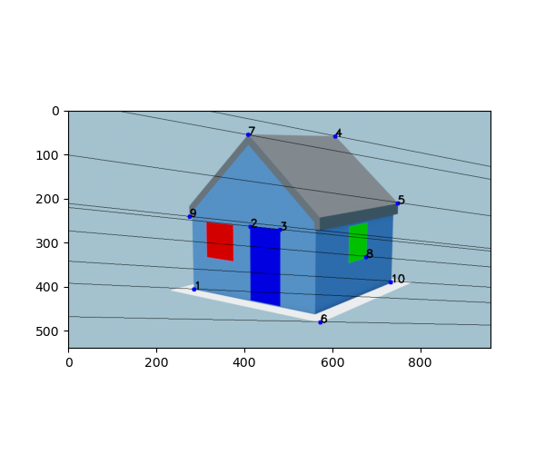
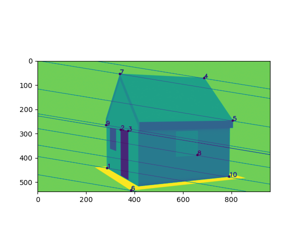

# Project 3

> ### Authors:
> Michele Cattaneo
> 
> Nicolai Hermann
> 
> Oliver Tryding

## Our solution:

We first of all implemented the 8-point algorithm and used it with the 10 known points to obtain an approximation of the fundamental matrix $F$.

This set can be executed on its own by running:
```shell
$ python eight_point_algorithm.py 
```
Which will plot the epipolar lines onto the images and will execute a sanity check on the matrix $F$ by ensuring that $x'^T F x \approx 0$.

<div style="display: flex;">
  
  
</div>


With $F$ we could define the canonical pair of cameras and use them to apply a linear triangulation of the 2d points to obtain the corresponding 3d points $\hat{X}$. However these points differ from the true points $X$ and we had to find the homography $H$ that relates the canonical camera pair $(\hat{P}, \hat{P'})$ with the correct camera pair $(P,P')$. This has been done with another DLT.

With this homography defined we could obtain the true camera pair and use it to reconstruct, via linear triangulation, 5 points taken from the pictures for which we do not know the true 3d coordinates. 

We then plot the true 3d points and the reconstructed 3d points to make sure that they overlap and finally plot the 10 known 3d points together with the 3d reconstruction of the unknown points and connect with edges some points to visualize the house structure.

## How to run:

```shell
$ python reconstruction_3d.py
```

We get the following:

Fundamental matrix:
```python
[[-3.02685408e-06  2.69507841e-07  8.85165828e-03]
 [ 1.77407268e-05  3.26778872e-06 -5.44410267e-02]
 [-9.35768472e-03  5.07471954e-02  1.00000000e+00]]
```
Canonical cameras:
```python
[[1. 0. 0. 0.]
 [0. 1. 0. 0.]
 [0. 0. 1. 0.]]

[[-1.49489701e-03  8.10690329e-03  1.59749920e-01  9.87083633e-01]
 [ 9.21058156e-03 -4.99494473e-02 -9.84280094e-01  1.60205807e-01]
 [ 1.79453841e-05  3.17336486e-06 -5.49992706e-02 -1.55584068e-05]]
 ```
True cameras:
```python
[[-4.47256384e+02 -6.74536030e+02  3.97010028e+01 -2.42589060e+03]
 [ 1.71511886e+01 -3.43776755e+01  7.65561768e+02 -1.87197461e+03]
 [ 3.17136543e-01 -4.56327100e-01  7.69246093e-02 -4.69646669e+00]]

[[ 3.61449346e+00  4.14106547e+01 -6.53242231e-01  1.08221469e+02]
 [-4.84100009e+00  2.56787447e+00 -3.90551195e+01  9.53437219e+01]
 [-2.54574822e-02  1.22413940e-02 -9.81561989e-04  2.06928591e-01]]
 ```
Reconstructed unknown points:
```python
[[-1.21563744e+00 -1.22059467e+00  1.88123667e-04  1.00000000e+00]
 [-2.65192787e-01 -1.01152183e+00  4.93281206e-01  1.00000000e+00]
 [ 1.58661451e-02 -1.00154709e+00  1.67297144e-02  1.00000000e+00]
 [ 1.00861798e+00 -2.33078448e-01  4.93871453e-01  1.00000000e+00]
 [ 1.05646207e+00 -9.97468623e-01  1.16022702e+00  1.00000000e+00]]
 ```
