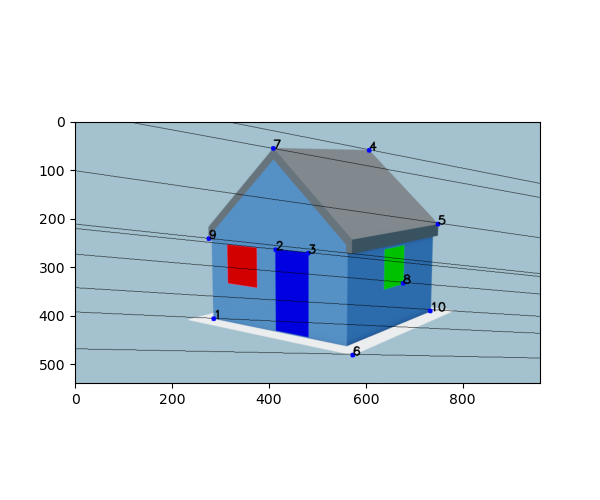

# Computer Vision project: 3D reconstruction from an image

## Part 1: Rectifying the house front that contains the red window and the blue door affinely

Applied Canny edge detection on the image:

Used the Hough transform on the detected edges to find lines on the front of the house. Then two set of lines that should be parallel in the real scene are selected.

  
  

By mapping the line that passes through the two intersection back to $l_{\infty}$ we got the affinely rectified image:

## Part 2: Recovering internal and external camera parameters from two pictures

Given the following set of enumerated points and their world coordinates, we could find the corresponding pixel coordinates of the same points from
some picture and use the DLT algorithm to recover the camera parameters of the camera that was used to generate the picture.

## Part 3: Reconstruction of world coordinates from image points

Approximated the fundamental matrix $F$ with the 8-point algorithm and got the following epipolar lines for the two images:

  
  

We then used the canonical camera pair  $(\hat{P}, \hat{P'})$ and linear triangulation to get the 3d coordinates of some known points $\hat{X}$ which are related to the true points $X$ by a homography $H$. By finding $H$ we can reconstruct the true camera pair $(P,P')$
 and use triangulation to find world coordinates of any image point.
